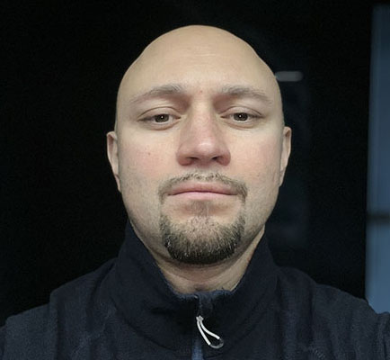

# **DIMITRY MAKAS**
### **Junior Frontend Developer**
---

### Contact
##### Location: Minsk, Belarus
##### Discord: Dimitry #3318
##### e-mail: dimiks.mks@gmail.com
---

### About me
##### I work for an insurance broker and in my free time I study front-end. I chose this direction, because it gives unlimited possibilities in creativity. I also like to see the result of my work immediately.
---

### Skills

* HTML, CSS, SASS, SCSS
* JavaScript basics
* Git, GitHub
* Figma
---

### Courses

* udemy.com (html, CSS)
* htmlacademy.ru
---
### I speak languages

* Belarusian (native)
* English (intermediate)
* Russian 

